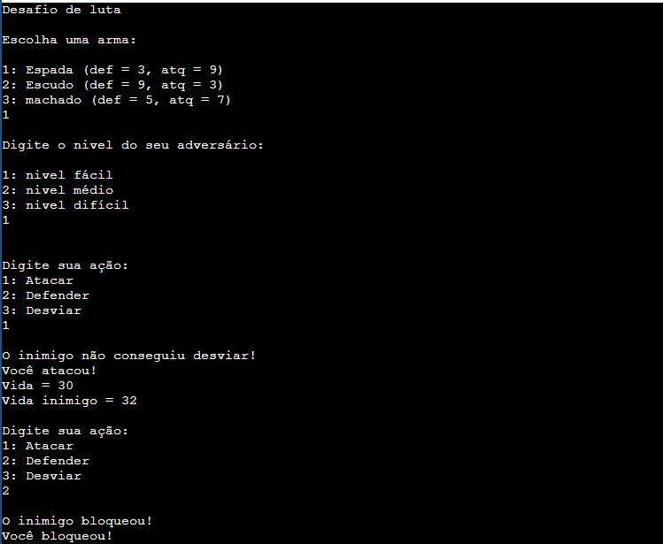

# Battle Game

Um jogo simples de luta em turnos, onde você escolhe uma arma, um nível de dificuldade e luta contra um bot que faz escolhas aleatórias a cada rodada

## Demonstração

## Pré-requisitos

- Compilador C, como o GCC.
- Terminal para executar o programa.
- Git, caso queira obter o projeto clonando o repositório.

## Instalação

1. Obter o projeto

Clone o repositório utilizando o Git:

git clone URL_DO_SEU_REPOSITORIO

Entre na pasta do projeto:

cd NOME_DO_REPOSITORIO

2. Compilar o programa

Se o código principal estiver no arquivo main.c e o compilador GCC estiver instalado, utilize:

gcc main.c -o battle

Esse comando compila o código-fonte e gera um executável chamado battle ou battle.exe, dependendo do ambiente.

Se o projeto utilizar outros arquivos-fonte, o comando de compilação deverá incluí-los também.

3. Executar o programa

No Windows, execute:

battle.exe

No Linux, execute:

./battle

No macOS, execute:

./battle

## Como jogar

O jogo acontece em turnos, você escolhe suas ações durante o combate, enquanto o inimigo realiza ações aleatórias.

Armas disponíveis

O jogador pode escolher entre três armas com diferentes atributos:

Arma	Defesa	Ataque
Espada	  3	      9
Escudo	  9	      3
Machado	  5	      7

Cada arma apresenta uma combinação diferente de ataque e defesa, permitindo escolher uma estratégia de combate.

Ações de combate

Atacar: ataca o inimigo, dando o dano determinado pelo ataque de cada arma.
Defender: Você se defende, reduzindo o dano do inimigo pela metade (caso ele ataque na rodada).
Desviar: Você desvia, há uma chance aleatória de não tomar dano de acordo com a dificuldade do jogo.

Níveis de dificuldade

O jogo possui configurações de dificuldade que alteram os atributos do inimigo.

Dificuldade	     Vida do inimigo    Dano do inimigo	   Chance de desvio
Fácil	                50	               10	               50%
Médio	                100	               20	               35%
Difícil	                200	               45	               20%

## Estrutura do projeto

battle-game/

|-- README.md
|-- LICENSE
|-- image.png
|__main.c
 

Descrição dos arquivos

main.c: contém o código-fonte principal do jogo.
README.md: apresenta o projeto e explica como instalar, executar e utilizar o programa.
LICENSE: contém os termos da licença escolhida para o projeto.
image.png: imagem que demonstra o jogo em funcionamento.

## Licença

Este projeto está distribuído sob a licença MIT.

Consulte o arquivo [LICENSE](LICENSE) para ler o texto completo da licença.